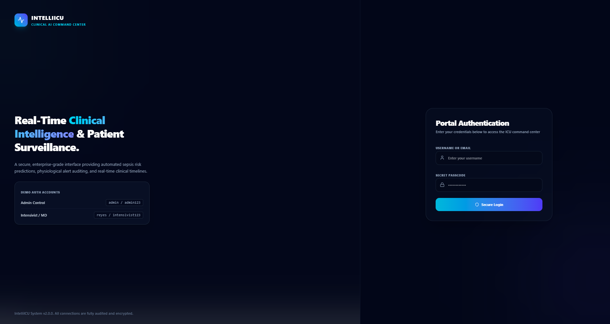
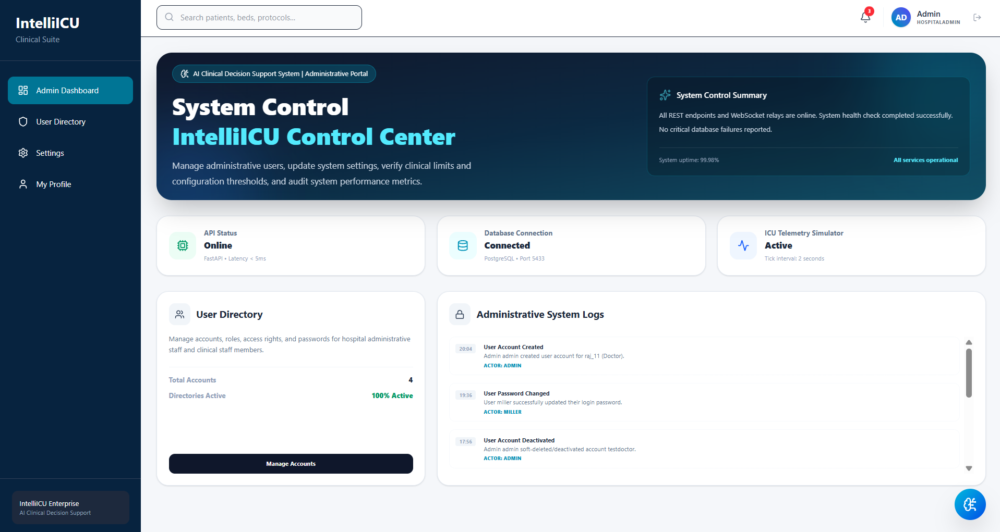
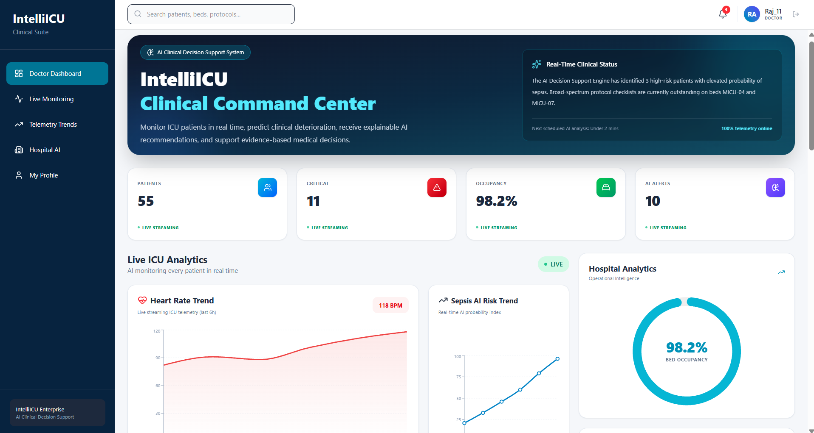
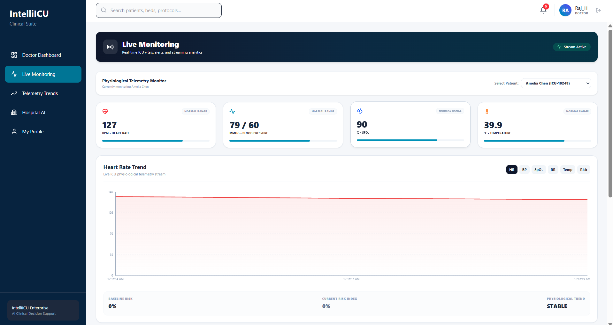
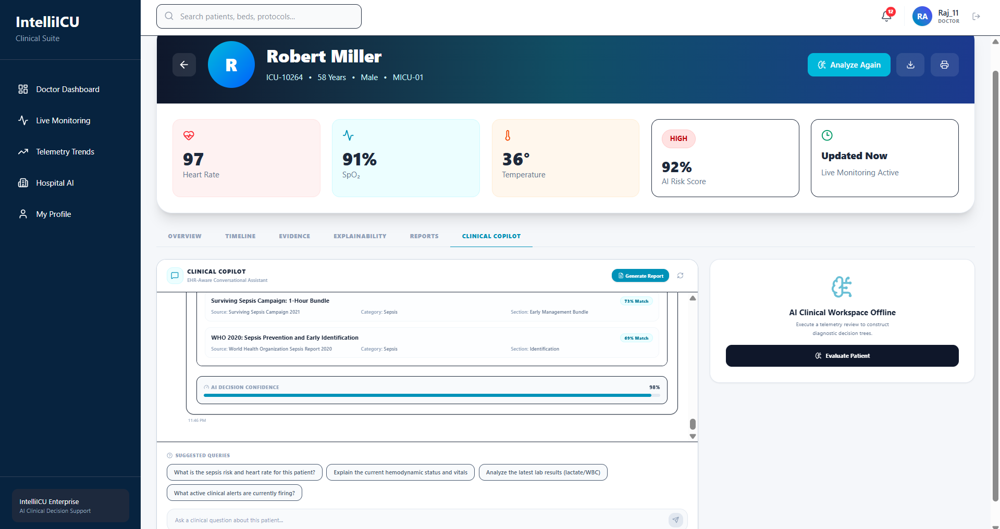
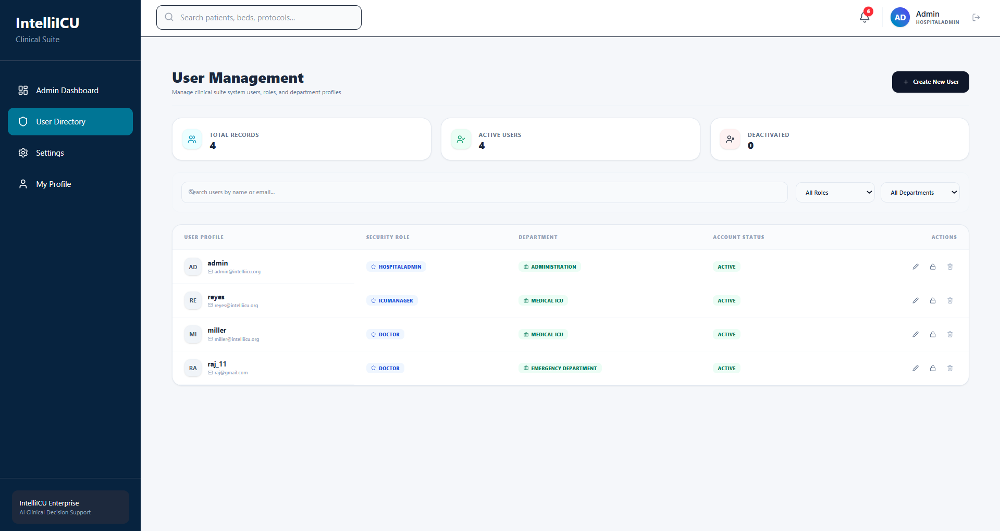

# 🏥 IntelliICU – Enterprise AI Clinical Decision Support System

<p align="center">


</p>

---

# 📌 Overview

**IntelliICU** is an **Enterprise AI Clinical Decision Support System (CDSS)** designed to simulate a modern hospital ICU platform.

The platform combines **real-time patient monitoring, AI-powered clinical decision support, role-based dashboards, telemetry streaming, explainable AI, Retrieval-Augmented Generation (RAG), and hospital analytics** into a single enterprise healthcare application.

This project was built as a portfolio-grade system inspired by platforms such as:

- Epic
- Oracle Cerner
- Philips IntelliVue
- GE Healthcare
- Microsoft Cloud for Healthcare

---

# ✨ Features

## Authentication & Security

- JWT Authentication
- Secure Login
- Role-Based Access Control (RBAC)
- Protected APIs
- Protected Routes

---

## Role-Based Dashboards

### 👨‍⚕️ Doctor

- Patient Monitoring
- Clinical AI Copilot
- Hospital AI Assistant
- Live Telemetry
- AI Predictions
- Clinical Timeline

### 👩‍⚕️ Nurse

- Assigned Patients
- Medication Workflow
- Alerts
- Nursing Dashboard
- Floating AI Assistant

### 👨‍💼 ICU Manager

- ICU Occupancy
- Critical Patient Monitoring
- Resource Management
- Operational Analytics
- Floating AI Assistant

### 🛠 Administrator

- User Management
- Departments
- Roles & Permissions
- System Health
- Audit Logs
- Floating AI Assistant

---

# 🤖 AI Features

## Clinical AI Copilot

Patient-specific clinical reasoning including:

- Risk Prediction
- Explainable AI
- SOFA Interpretation
- Lab Analysis
- Clinical Reports
- Treatment Suggestions

---

## Hospital Assistant

Hospital-wide operational intelligence:

- Hospital Overview
- Critical Patients
- Alert Summary
- ICU Occupancy
- Operational Reports
- AI Insights

---

## Retrieval-Augmented Generation (RAG)

- Clinical Knowledge Search
- Guideline Retrieval
- AI Context Enrichment

---

# 📊 Enterprise Modules

- Dashboard
- Patient Management
- Live Monitoring
- Telemetry Dashboard
- Alerts
- Clinical Timeline
- Clinical AI
- Hospital Assistant
- Reports
- User Management
- Departments
- AI Provider Management

---

# 🖥 Screenshots

## Login



---

## Admin Dashboard



---

## Doctor Dashboard



---

## Live Monitoring



---

## Telemetry


---

## Hospital Assistant


---

## Clinical AI Copilot



---

## User Management



---

# 🏗 System Architecture

```
Users
│
├── Administrator
├── Doctor
├── Nurse
└── ICU Manager
        │
        ▼
React Frontend
        │
 REST APIs + WebSockets
        │
FastAPI Backend
        │
──────────────────────────────
│
├── Authentication
├── RBAC
├── AI Engine
├── Clinical AI
├── Hospital Assistant
├── Telemetry
├── Alerts
├── Timeline
├── RAG
│
──────────────────────────────
        │
PostgreSQL
```

---

# ⚙ Technology Stack

## Frontend

- React
- JavaScript
- Vite
- Material UI
- React Router
- Axios

## Backend

- FastAPI
- Python
- SQLAlchemy
- Alembic
- JWT Authentication
- WebSockets

## Database

- PostgreSQL
- SQLite (Development)

## AI

- OpenAI
- Gemini
- Ollama
- LM Studio
- Mock Provider

## DevOps

- Git
- GitHub

---

# 📁 Project Structure

```
IntelliICU
│
├── backend/
├── frontend/
├── screenshots/
├── README.md
├── LICENSE
└── .gitignore
```

---

# 🚀 Installation

## Backend

```bash
cd backend

python -m venv .venv

pip install -r requirements.txt

uvicorn app.main:app --reload
```

---

## Frontend

```bash
cd frontend

npm install

npm run dev
```

---

# 🔐 Demo Accounts

| Role | Username |
|-------|----------|
| Admin | admin |
| Doctor | miller |
| ICU Manager | reyes |

> Passwords depend on your local seeded database.

---

# 📈 Future Enhancements

- Docker Deployment
- Kubernetes Support
- HL7/FHIR Integration
- PACS Integration
- Multi-Hospital Support
- Mobile Application
- Cloud Deployment
- Predictive Analytics
- Voice Assistant

---

# 📚 Learning Outcomes

This project demonstrates:

- Enterprise Architecture
- FastAPI Development
- React Development
- JWT Authentication
- RBAC
- WebSockets
- AI Integration
- RAG Systems
- Healthcare Workflows
- REST APIs
- Real-Time Monitoring

---

# 👨‍💻 Developer

**Sumeet Sonar**

Bachelor of Engineering (Information Technology)

Mumbai University

---

# ⭐ Support

If you found this project useful, consider giving it a **Star ⭐** on GitHub.

---

# 📄 License

This project is licensed under the **MIT License**.