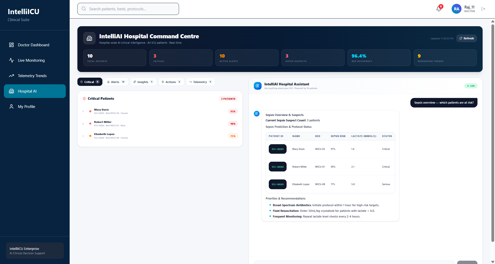
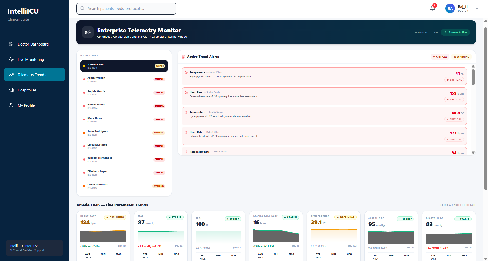

# 🏥 IntelliICU — Enterprise AI Clinical Decision Support Platform

<p align="center">
  <strong>AI-Powered Clinical Decision Support, ICU Monitoring, Clinical Copilot, and Hospital Intelligence Platform</strong>
</p>

<p align="center">
  An enterprise-grade healthcare AI platform designed to support clinicians with intelligent patient monitoring, real-time telemetry, AI-assisted clinical decision support, and hospital management capabilities.
</p>

---

## 🚀 Live Deployment

The IntelliICU platform is deployed on Railway with separate frontend and backend services.

### 🌐 Live Application

[**Open IntelliICU Live Demo**](https://intelliicu-frontend-production.up.railway.app)

### ⚙️ Backend API

[**IntelliICU Backend API**](https://intelliicu-production.up.railway.app)

### 📚 API Documentation

[**FastAPI Swagger Documentation**](https://intelliicu-production.up.railway.app/docs)

### 🏗️ Deployment Architecture

```text
User / Browser
      │
      ▼
React + Vite Frontend
Nginx • Railway
      │
      │ HTTPS REST API
      │ Secure WebSocket
      ▼
FastAPI Backend
Railway
      │
      ▼
PostgreSQL Database
```

---

## 📌 Overview

**IntelliICU** is an Enterprise AI Clinical Decision Support System (CDSS) designed to demonstrate how Artificial Intelligence, Machine Learning, real-time patient monitoring, and modern full-stack technologies can be integrated into a unified healthcare platform.

The system provides dedicated interfaces for administrators and healthcare professionals while supporting AI-assisted clinical workflows, live ICU monitoring, telemetry visualization, clinical copilot functionality, and hospital management.

IntelliICU is designed as a portfolio-quality enterprise healthcare application with a scalable architecture, separated frontend and backend services, REST APIs, authentication, database integration, containerization, and cloud deployment capabilities.

The long-term vision of IntelliICU is to build a comprehensive AI-powered healthcare intelligence platform inspired by modern enterprise healthcare ecosystems.

> **Important:** IntelliICU is an educational and research-oriented project. It is not intended to replace professional medical judgment or be used as a certified medical device.

---

# ✨ Key Features

## 🔐 Authentication & Security

- Secure user authentication
- JWT-based authentication
- Password hashing
- Role-Based Access Control (RBAC)
- Protected API endpoints
- Token validation
- Role-specific application access

---

## 👨‍⚕️ Doctor Dashboard

A dedicated dashboard for healthcare professionals providing access to clinical information and AI-assisted workflows.

Features include:

- Clinical overview
- Patient information
- ICU monitoring
- Clinical decision support
- AI-powered clinical tools
- Hospital workflow access
- Real-time patient information

---

## 🛡️ Admin Dashboard

Centralized administrative dashboard for managing the IntelliICU platform.

Features include:

- Platform overview
- User management
- Hospital management
- System statistics
- Administrative controls
- Role management
- Operational monitoring

---

## 🤖 AI Clinical Copilot

The Clinical Copilot provides an AI-assisted interface designed to support healthcare professionals during clinical workflows.

Potential capabilities include:

- Clinical information assistance
- Patient context analysis
- Decision-support insights
- Risk interpretation
- Clinical recommendations
- Medical knowledge assistance
- Context-aware AI interactions

The Clinical Copilot is designed as a **decision-support tool** and does not replace professional medical judgment.

---

## 🏥 Hospital Assistant

AI-powered hospital assistance functionality designed to support hospital operations and healthcare workflows.

Features may include:

- Hospital information assistance
- Clinical workflow support
- Healthcare-related queries
- Operational assistance
- AI-powered interaction
- Context-aware responses

---

## 📡 Live ICU Monitoring

The Live Monitoring module provides real-time visualization of patient and ICU information.

Capabilities include:

- Live patient monitoring
- Vital-sign visualization
- Patient status tracking
- Clinical alerts
- Real-time dashboard updates
- ICU patient overview

---

## 📊 Telemetry Monitoring

The Telemetry Monitor provides continuous visualization of patient physiological data.

Designed to support monitoring of information such as:

- Heart rate
- Blood pressure
- Oxygen saturation
- Respiratory rate
- Temperature
- Other clinical telemetry signals

The telemetry interface demonstrates how real-time patient information can be integrated into an AI-powered clinical platform.

---

## 👥 User Management

Administrative user management functionality for controlling access to the platform.

Features include:

- View users
- Manage user accounts
- Role assignment
- User status management
- Access control
- Administrative actions

---

# 🖼️ Application Screenshots

## 🔐 Login

The IntelliICU authentication interface provides secure access to the platform.


---

## 🛡️ Admin Dashboard

The Admin Dashboard provides centralized control and visibility across the IntelliICU platform.


---

## 👨‍⚕️ Doctor Dashboard

The Doctor Dashboard provides healthcare professionals with access to clinical workflows, monitoring tools, and patient information.


---

## 🤖 Clinical Copilot

The AI-powered Clinical Copilot assists healthcare professionals with clinical information and decision-support workflows.


---

## 🏥 Hospital Assistant

The Hospital Assistant provides an AI-powered interface for healthcare and hospital-related assistance.



---

## 📡 Live Monitoring

The Live Monitoring dashboard provides real-time visibility into patient and ICU information.


---

## 📈 Telemetry Monitor

The Telemetry Monitor provides visualization of real-time physiological and clinical telemetry data.



---

## 👥 User Management

The User Management interface allows administrators to manage platform users, roles, and access.


---

# 🏗️ System Architecture

IntelliICU follows a modular full-stack architecture designed for scalability, maintainability, and future healthcare AI integrations.

```text
                        ┌─────────────────────┐
                        │        Users        │
                        │                     │
                        │  Admins / Doctors   │
                        └──────────┬──────────┘
                                   │
                                   ▼
                        ┌─────────────────────┐
                        │   React Frontend    │
                        │                     │
                        │ Dashboards & UI     │
                        └──────────┬──────────┘
                                   │
                              REST API
                                   │
                                   ▼
                     ┌───────────────────────────┐
                     │      FastAPI Backend      │
                     └─────────────┬─────────────┘
                                   │
             ┌─────────────────────┼─────────────────────┐
             │                     │                     │
             ▼                     ▼                     ▼
    ┌────────────────┐    ┌────────────────┐    ┌────────────────┐
    │ Authentication │    │ Clinical / AI  │    │ Hospital APIs  │
    │     & RBAC      │    │    Services    │    │ & Management   │
    └───────┬────────┘    └───────┬────────┘    └───────┬────────┘
            │                     │                     │
            └─────────────────────┼─────────────────────┘
                                  │
                                  ▼
                       ┌─────────────────────┐
                       │   Database Layer    │
                       │                     │
                       │ SQLAlchemy /        │
                       │ PostgreSQL          │
                       └─────────────────────┘
```

---

# 📁 Project Structure

```text
INTELLIICU/
│
├── .github/
│   ├── ISSUE_TEMPLATE/
│   ├── workflows/
│   └── pull_request_template.md
│
├── assets/
│   └── Project assets and static resources
│
├── backend/
│   └── FastAPI backend application
│
├── config/
│   └── Application configuration
│
├── docker/
│   └── Docker configuration files
│
├── docs/
│   └── Project documentation
│
├── frontend/
│   └── React + Vite frontend application
│
├── infra/
│   └── Infrastructure configuration
│
├── screenshots/
│   ├── admin-dashboard.png
│   ├── clinical-copilot.png
│   ├── doctor-dashboard.png
│   ├── hospital-assistant.png
│   ├── live-monitoring.png
│   ├── login.png
│   ├── telemetry-monitor.png
│   └── user-management.png
│
├── scripts/
│   └── Development and deployment scripts
│
├── src/
│   └── Supporting source code
│
├── tests/
│   └── Automated tests
│
├── .env.example
├── .gitignore
├── CONTRIBUTING.md
├── docker-compose.yml
├── LICENSE
└── README.md
```

> Local development directories such as `.venv/`, `node_modules/`, and generated build artifacts are excluded from version control and are not part of the repository structure.

---

# 🛠️ Technology Stack

## Frontend

- React
- Vite
- JavaScript
- Modern Component-Based UI
- REST API Integration
- WebSocket Integration
- Responsive Dashboard Design
- Nginx Production Server

## Backend

- Python
- FastAPI
- REST API Architecture
- Pydantic
- SQLAlchemy
- Uvicorn

## Database

- PostgreSQL
- SQLAlchemy ORM

## AI & Machine Learning

- Python
- Scikit-learn
- Pandas
- NumPy
- Machine Learning Models
- Retrieval-Augmented Generation (RAG)
- AI Clinical Decision Support
- Clinical Copilot
- LLM Provider Architecture

## Security

- JWT Authentication
- Password Hashing
- Role-Based Access Control (RBAC)
- Protected API Routes
- CORS Configuration
- Environment-Based Secrets

## Real-Time Communication

- WebSockets
- Live ICU Telemetry
- Real-Time Dashboard Updates
- Patient Monitoring Streams

## DevOps & Infrastructure

- Docker
- Docker Compose
- GitHub
- GitHub Actions
- Railway
- Nginx
- CI/CD Pipeline
- Cloud Deployment Architecture

---

# 🚀 Getting Started

## Prerequisites

Before running IntelliICU locally, make sure you have installed:

- Python 3.10+
- Node.js 20+
- npm
- Git
- Docker (optional)
- PostgreSQL (if running the database locally)

---

# 📥 Clone the Repository

```bash
git clone https://github.com/Sumeet2005/IntelliICU.git
cd IntelliICU
```

---

# ⚙️ Environment Configuration

Create your local environment file using the provided example:

```bash
cp .env.example .env
```

On Windows PowerShell:

```powershell
Copy-Item .env.example .env
```

Configure the required environment variables inside `.env`.

> Never commit your actual `.env` file, production credentials, database passwords, JWT secrets, or API keys to GitHub.

---

# 🐍 Backend Setup

Navigate to the backend directory:

```bash
cd backend
```

Create a virtual environment:

```bash
python -m venv .venv
```

Activate the virtual environment.

### Windows

```powershell
.venv\Scripts\Activate.ps1
```

### Linux / macOS

```bash
source .venv/bin/activate
```

Install backend dependencies:

```bash
pip install -r requirements.txt
```

Start the FastAPI development server:

```bash
uvicorn app.main:app --reload
```

The backend will typically be available at:

```text
http://localhost:8000
```

Interactive Swagger API documentation:

```text
http://localhost:8000/docs
```

Alternative ReDoc documentation:

```text
http://localhost:8000/redoc
```

---

# 💻 Frontend Setup

Open a new terminal and navigate to the frontend directory:

```bash
cd frontend
```

Install dependencies:

```bash
npm install
```

Start the development server:

```bash
npm run dev
```

The frontend will typically be available at:

```text
http://localhost:5173
```

To create a production build:

```bash
npm run build
```

---

# 🐳 Docker Setup

The application can be started using Docker Compose:

```bash
docker compose up --build
```

To stop the containers:

```bash
docker compose down
```

To rebuild the application:

```bash
docker compose up --build --force-recreate
```

---

# 🔐 Environment Variables

The project uses environment variables for application configuration, database connectivity, authentication, AI providers, and deployment settings.

Refer to:

```text
.env.example
```

for the available environment configuration template.

Important configuration categories include:

- Project metadata
- PostgreSQL database configuration
- JWT authentication settings
- Clinical LLM provider configuration
- OpenAI configuration
- Google Gemini configuration
- Ollama configuration
- LM Studio configuration
- Deployment settings

> Production secrets should be configured directly through the deployment platform and must never be committed to source control.

---

# 📚 API Documentation

Once the backend is running, FastAPI automatically provides interactive API documentation.

### Swagger UI

```text
http://localhost:8000/docs
```

### ReDoc

```text
http://localhost:8000/redoc
```

The documentation allows developers to:

- Explore available API endpoints
- View request and response schemas
- Test API requests
- Review authentication requirements
- Understand API models

For the deployed application, use the live Swagger documentation linked at the top of this README.

---

# 🧩 Core Platform Modules

| Module | Description |
|---|---|
| 🔐 Authentication | Secure authentication and authorization |
| 👨‍⚕️ Doctor Dashboard | Clinical dashboard for healthcare professionals |
| 🛡️ Admin Dashboard | Administrative platform management |
| 🤖 Clinical Copilot | AI-assisted clinical decision support |
| 🏥 Hospital Assistant | AI-powered hospital assistance |
| 📡 Live Monitoring | Real-time patient and ICU monitoring |
| 📈 Telemetry Monitor | Patient physiological telemetry visualization |
| 👥 User Management | User and role administration |
| 🔒 RBAC | Role-Based Access Control |
| 🔌 REST API | Frontend-backend application communication |
| ⚡ WebSockets | Real-time telemetry and dashboard communication |
| 🗄️ PostgreSQL | Persistent relational data storage |

---

# 🔄 CI/CD

IntelliICU uses GitHub Actions for continuous integration.

The CI pipeline validates important parts of the application, including:

- Backend dependency installation
- Python application compile checks
- Frontend dependency installation
- Vite production build validation

This helps identify integration and build problems before changes are deployed.

---

# ☁️ Production Deployment

The production architecture separates the application into independent services.

```text
Internet
   │
   ├──► React + Vite Frontend
   │       │
   │       └── Nginx
   │            │
   │            ▼
   │         Railway
   │
   └──► FastAPI Backend
           │
           ▼
        Railway
           │
           ▼
       PostgreSQL
```

The frontend communicates with the backend through HTTPS REST APIs and secure WebSocket connections.

Production environment variables are managed through the deployment platform.

---

# 🧪 Testing

The project includes a dedicated testing directory:

```text
tests/
```

Backend tests can be executed using:

```bash
pytest
```

Testing is an important part of the IntelliICU architecture to ensure:

- API reliability
- Authentication correctness
- Data validation
- Clinical service reliability
- Regression prevention

---

# 🗺️ Future Roadmap

Planned future improvements include:

- Advanced AI Clinical Decision Support
- Multi-Hospital Architecture
- Multi-Tenant Support
- Real-Time ICU Event Streaming
- Advanced Patient Telemetry
- Early Warning Systems
- Sepsis Risk Prediction
- Cardiac Risk Prediction
- Clinical Deterioration Prediction
- Explainable AI (XAI)
- AI Model Monitoring
- Model Versioning
- Clinical Audit Logging
- Notification and Alert System
- FHIR Integration
- HL7 Integration
- Electronic Health Record (EHR) Integration
- Medical Imaging Integration
- Wearable Device Integration
- Advanced Role-Based Access Control
- Kubernetes Deployment
- Advanced CI/CD
- Cloud-Native Infrastructure
- Observability and Monitoring

---

# 🎯 Project Goals

The primary goals of IntelliICU are to demonstrate practical experience in:

- Enterprise Software Architecture
- Healthcare Software Engineering
- Artificial Intelligence
- Machine Learning Integration
- Clinical Decision Support Systems
- Full-Stack Development
- REST API Design
- Authentication and Authorization
- Role-Based Access Control
- Real-Time Monitoring Systems
- WebSocket Communication
- Database Architecture
- Docker Containerization
- Cloud Deployment
- CI/CD
- Scalable System Design
- Production-Oriented Software Development

---

# ⚠️ Medical Disclaimer

IntelliICU is developed for **educational, research, demonstration, and portfolio purposes**.

The platform:

- Is not a certified medical device.
- Is not intended for direct clinical diagnosis.
- Is not intended to replace qualified healthcare professionals.
- Should not be used as the sole basis for medical decisions.
- Does not provide professional medical advice.

Any AI-generated predictions, recommendations, alerts, or clinical information produced by the system should be treated as **decision-support information only**.

Clinical decisions must always be made by qualified healthcare professionals using appropriate clinical judgment.

---

# 🤝 Contributing

Contributions, suggestions, and improvements are welcome.

Please refer to:

```text
CONTRIBUTING.md
```

for contribution guidelines.

General contribution workflow:

```bash
git checkout -b feature/your-feature-name
git add .
git commit -m "feat: add your feature"
git push origin feature/your-feature-name
```

Then create a Pull Request.

---

# 🔒 Security

Healthcare applications require strong security practices.

When contributing to or deploying IntelliICU:

- Never commit `.env` files.
- Never expose database credentials.
- Never commit API keys.
- Never store plaintext passwords.
- Use secure JWT secrets.
- Apply proper authentication and authorization.
- Validate all incoming data.
- Follow the principle of least privilege.

For production healthcare use, additional regulatory, security, privacy, compliance, validation, and clinical governance requirements would be necessary.

---

# 📄 License

This project is licensed under the terms specified in the:

```text
LICENSE
```

file included in this repository.

---

# 👨‍💻 Author

**Sumeet Sonar**

B.E. Information Technology — 2026

AI, Data Science & Full-Stack Development

Interested in building enterprise AI systems, healthcare technology, and intelligent software platforms.

---

# ⭐ Support

If you find IntelliICU interesting or useful, consider giving the repository a **⭐ Star**.

It helps support the project and its continued development.

---

<p align="center">
  <strong>IntelliICU</strong>
</p>

<p align="center">
  Building the future of AI-powered Clinical Decision Support and Intelligent Healthcare Systems.
</p>
