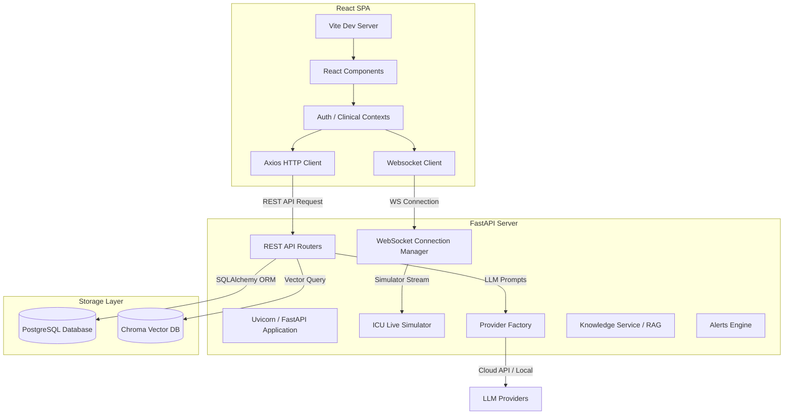
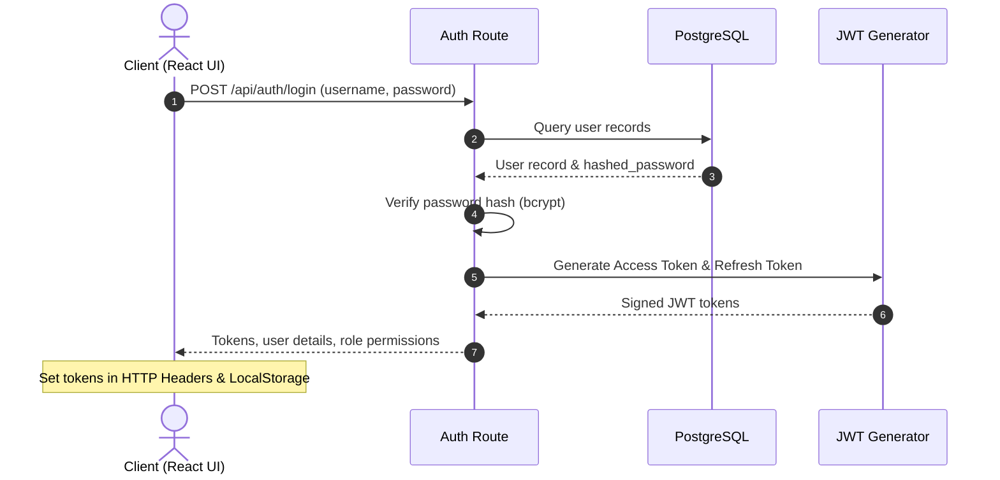
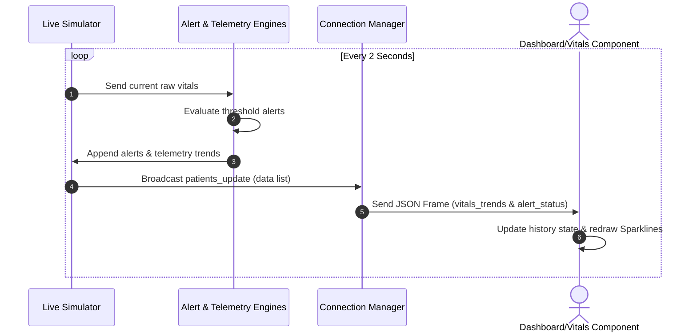

# 🏥 IntelliICU — Enterprise AI Clinical Decision Support System (CDSS)

<p align="center">
  
</p>

<p align="center">
  
  
  
  
  
  
  
  
  
  
</p>

---

## 📌 1. Overview

**IntelliICU** is a state-of-the-art **Enterprise AI Clinical Decision Support System (CDSS)** designed to simulate a modern hospital intensive care unit platform. Inspired by world-class, commercial electronic health record (EHR) and monitoring suites such as **Epic, Oracle Cerner, Philips IntelliVue, and Microsoft Cloud for Healthcare**, IntelliICU provides clinicians, nurses, operations managers, and administrators with a centralized, data-driven workspace.

### ⚠️ The Business Problem
Modern intensive care units suffer from severe cognitive overload. Clinicians are bombarded with disjointed telemetry data streams, scattered lab values, complex drug interactions, and unmonitored risk trends. Key signs of deterioration (such as early sepsis indicators, respiratory failure, or drug dosage errors) are often lost in noise, leading to delayed clinical decisions, increased length of stay, and patient safety incidents.

### 💡 The Solution
IntelliICU unifies real-time physiological telemetry streams, electronic health records, dynamic predictive risk modeling, and a hybrid RAG (Retrieval-Augmented Generation) knowledge engine into a responsive, secure, role-based dashboard. It automates risk monitoring, interprets complex patient vitals, highlights critical trend warnings, and provides explaining clinical justification (Explainable AI) to aid clinical staff at the point of care.

---

## ✨ 2. Features

### 🔐 Security & User Administration
* **JWT Authentication**: Secure stateless authentication pipeline featuring token expiration, sliding-session refresh tokens, and logout blacklisting.
* **Role-Based Access Control (RBAC)**: Fine-grained permissions guard routes, UI widgets, and APIs based on user roles (`SuperAdmin`, `HospitalAdmin`, `Doctor`, `Nurse`, `ICUManager`).
* **Audit Trail logging**: Detailed event auditing tracking patient access, manual telemetry updates, AI generation requests, and clinical notes.

### 📋 Patient & Telemetry Management
* **Patient Census & Profiles**: Deep clinical files comprising patient demographics, height, weight, active admission diagnosis, attending physician, and bed configuration.
* **Live Telemetry & Vitals Monitor**: WebSocket-powered continuous updates of physiological parameters (Heart Rate, MAP, SpO₂, Respiratory Rate, Temperature, SBP, DBP) rendering in live, interactive sparkline graphs.
* **Historical Trend Analyses**: Rolling vital sign history supporting metric selection and visual time-series regression.
* **Laboratory Interpretations**: Visual representation of blood counts, electrolytes, biochemistry, and lactate levels with highlighted clinical abnormalities.

### 🚨 Real-time Alerts & Clinical Timeline
* **Alert Engine**: Evaluates incoming telemetry signals against physiological thresholds to raise warnings (`CRITICAL`, `WARNING`, `WATCH`, `NORMAL`).
* **Alert Action Center**: Features for acknowledgment, assignment, escalation, and resolution of patient alerts.
* **Clinical Event Timeline**: Chronological event logs detailing vital updates, admission modifications, laboratory releases, and AI analysis reports.

### 🤖 Dual-Engine Doctor AI
* **Clinical AI Copilot (Patient-Specific)**: Located on patient profile pages. Performs differential diagnosis, SOFA score calculations, laboratory interpretation, and outputs structured Clinical Reports.
* **IntelliAI Hospital Assistant (Hospital-Wide)**: Located on the Command Centre page. Synthesizes aggregate ICU census snapshots, bed capacity, alert trends, and sepsis risks into markdown tables and operations summaries.

### 💬 Floating Role-Specific Assistants
* **Admin Assistant**: Responds only to system health status, active users, DB status, and configuration commands.
* **Nurse Assistant**: Responds only to nursing tasks, active alerts, and medication workflows.
* **ICU Manager Assistant**: Responds only to bed utilization, staffing, response times, and unit analytics.
* *Note: Floating chatbots strictly enforce domain boundaries and refuse patient diagnostic commands, redirecting clinicians to the Clinical Copilot.*

---

## 🤖 3. AI Architecture

IntelliICU employs a modular, abstract provider layer that allows hot-swapping between local models and commercial cloud APIs via runtime settings.

```
                    ┌────────────────────────┐
                    │  Hospital Assistant /  │
                    │    Clinical Copilot    │
                    └───────────┬────────────┘
                                │
                                ▼
                    ┌────────────────────────┐
                    │   Config Manager /     │
                    │   Provider Factory     │
                    └───────────┬────────────┘
                                │
         ┌──────────────────────┼──────────────────────┬──────────────────────┐
         ▼                      ▼                      ▼                      ▼
┌─────────────────┐    ┌─────────────────┐    ┌─────────────────┐    ┌─────────────────┐
│     OpenAI      │    │  Google Gemini  │    │     Ollama      │    │    LM Studio    │
│   (gpt-4o)      │    │  (gemini-1.5)   │    │  (local llama)  │    │ (local mistral) │
└─────────────────┘    └─────────────────┘    └─────────────────┘    └─────────────────┘
```

* **Provider Factory**: `get_llm_provider()` acts as a centralized switcher checking configured endpoints, environmental keys, and SDK compatibility.
* **Cloud Inference (OpenAI & Gemini)**: Used for complex clinical report generation, structured JSON schema outputs, and multi-source medical retrieval.
* **Local Inference (Ollama & LM Studio)**: Supports offline operations, ensuring that HIPAA-sensitive patient telemetry parameters are evaluated within local infrastructure using lightweight models (e.g., Llama 3, Mistral).
* **Mock Provider (Clinical Fallback)**: A high-fidelity simulated clinical LLM. If cloud or local connections drop, the Mock Provider parses intents dynamically from live database snapshots, returning structured markdown answers, recommendation tables, and clinical explanations.

---

## 📊 4. System Architecture

### 🌐 Overall Architecture


### 🔐 Authentication Flow


### 📡 WebSocket Telemetry Flow


---

## 💻 5. Technology Stack

### Frontend
* **Core**: React 19, JavaScript (ES6+), HTML5
* **Styling**: TailwindCSS 4 (Utility-first styling, glassmorphism UI layouts)
* **Routing & State**: React Router DOM 7, Context API, TanStack React Query 5
* **Visualizations**: Recharts 3 (Physiological area charts, bed utilization gauges)
* **Animation**: Framer Motion 12 (Dynamic transitions, slide-out panels, drawer overlays)
* **Markdown Rendering**: `react-markdown` + `remark-gfm`

### Backend
* **Web Framework**: FastAPI (Asynchronous REST API endpoints, lifespan context)
* **Web Server**: Uvicorn (ASGI server implementation)
* **Database Toolkit**: SQLAlchemy 2 (ORM mapping, async querying), Alembic (DB migrations)
* **Security**: PyJWT (Signature generation, claims verification), bcrypt (Password hashing)
* **Analytics**: ReportLab (Generates production-grade Clinical PDF Reports)

### Database & Storage
* **SQL Database**: PostgreSQL 15 (Relational patient history, logs, and user schemas)
* **Vector Database**: ChromaDB (Stores chunked clinical guidelines, KDIGO, WHO manuals)

---

## 📂 6. Project Structure

```directory
IntelliICU/
├── backend/
│   ├── alembic/                 # Alembic migration scripts
│   ├── app/
│   │   ├── ai/                  # LLM provider factory, prompt builder, predictor
│   │   │   └── providers/       # OpenAI, Gemini, Ollama, LM Studio implementations
│   │   ├── api/                 # REST API endpoints (Auth, Patients, RAG, AI)
│   │   ├── database/            # SQLAlchemy database setup, schemas, and seeder
│   │   ├── models/              # Patient, Admission, Vitals SQLAlchemy entities
│   │   ├── rag/                 # Retrieval-Augmented Generation core engine
│   │   ├── services/            # Business logic (Knowledge, Alerting, Event engines)
│   │   └── websocket/           # WebSocket routers, Connection Manager, and Live Simulator
│   ├── ml_models/               # Pre-trained files for predictive indicators
│   ├── vector_db/               # ChromaDB sqlite storage location
│   ├── Dockerfile
│   ├── requirements.txt         # Backend Python dependencies
│   └── alembic.ini
├── frontend/
│   ├── src/
│   │   ├── api/                 # Axios clients configured with base URL
│   │   ├── components/
│   │   │   ├── auth/            # Auth and Permission Route Guards
│   │   │   ├── clinicalCopilot/ # Patient Profile AI assistants, StreamingMarkdown
│   │   │   ├── dashboardV2/     # Alerts, Hero banners, KPIs, and Census list widgets
│   │   │   ├── hospitalAssistant/ # Command Centre interface
│   │   │   └── telemetry/       # Trend charts, timeline, sparklines
│   │   ├── context/             # AuthContext, ClinicalAIContext (WebSocket listeners)
│   │   ├── layouts/             # Sidebar, Topbar, Layout containers
│   │   ├── pages/               # Main page index views
│   │   └── services/            # Axios API wrappers
│   ├── Dockerfile
│   ├── package.json             # Frontend package configurations
│   └── vite.config.js           # Build settings
├── screenshots/                 # Application screenshots
├── docker-compose.yml           # Multi-container deployment orchestrator
└── README.md
```

---

## ⚙️ 7. Installation & Setup

### Prerequisites
* Python 3.11+
* Node.js 18+
* PostgreSQL 15+

### Backend Installation
1. Navigate to the backend directory:
   ```bash
   cd backend
   ```
2. Create and activate a virtual environment:
   ```bash
   python -m venv .venv
   # On Windows
   .venv\Scripts\activate
   # On macOS/Linux
   source .venv/bin/activate
   ```
3. Install dependencies:
   ```bash
   pip install -r requirements.txt
   ```
4. Configure environment variables (copy `.env.example` to `.env` and customize):
   ```bash
   cp .env.example .env
   ```
5. Run migrations to initialize the database schema:
   ```bash
   alembic upgrade head
   ```
6. Start the FastAPI application:
   ```bash
   python -m uvicorn app.main:app --host 127.0.0.1 --port 8000 --reload
   ```

### Frontend Installation
1. Navigate to the frontend directory:
   ```bash
   cd ../frontend
   ```
2. Install npm packages:
   ```bash
   npm install
   ```
3. Start the Vite development server:
   ```bash
   npm run dev
   ```
4. Access the web interface at `http://localhost:5173`.

---

## 🔧 8. Configuration

Open the `.env` file in the `backend` directory to set your AI provider parameters:

### OpenAI Configuration
```env
CLINICAL_LLM_PROVIDER=openai
CLINICAL_LLM_MODEL=gpt-4o
OPENAI_API_KEY=your-openai-api-key-here
```

### Google Gemini Configuration
```env
CLINICAL_LLM_PROVIDER=gemini
CLINICAL_LLM_MODEL=gemini-1.5-pro
GEMINI_API_KEY=your-gemini-api-key-here
```

### Local Ollama Configuration
1. Make sure Ollama is running locally:
   ```bash
   ollama run llama3
   ```
2. Set configuration:
   ```env
   CLINICAL_LLM_PROVIDER=ollama
   OLLAMA_HOST=http://localhost:11434
   OLLAMA_MODEL=llama3
   ```

### LM Studio Configuration
1. Start LM Studio and host a local server on port `1234`.
2. Configure settings:
   ```env
   CLINICAL_LLM_PROVIDER=lmstudio
   LMSTUDIO_BASE_URL=http://localhost:1234/v1
   ```

---

## 📸 9. Screenshots

<details>
<summary>🔑 View Login Page</summary>
<br/>

</details>

<details>
<summary>👨‍⚕️ View Doctor Dashboard</summary>
<br/>

</details>

<details>
<summary>👩‍⚕️ View Live Vitals Monitor</summary>
<br/>

</details>

<details>
<summary>📈 View Enterprise Telemetry Trends</summary>
<br/>

</details>

<details>
<summary>🤖 View Clinical AI Copilot Panel</summary>
<br/>

</details>

<details>
<summary>🏥 View Hospital AI Assistant</summary>
<br/>

</details>

<details>
<summary>🛠 View User Directory & System Configuration</summary>
<br/>

</details>

---

## 🔌 10. API Overview

IntelliICU surfaces a REST API conforming to OpenAPI specifications. Below are the key endpoints:

| Module | Method | Endpoint | Description |
| :--- | :--- | :--- | :--- |
| **Authentication** | `POST` | `/api/auth/login` | Authenticates username/password, issues tokens |
| | `POST` | `/api/auth/refresh` | Generates new Access Token using Refresh Token |
| | `GET` | `/api/auth/me` | Returns current user details and permissions |
| **Patients** | `GET` | `/api/patients/` | Fetches active ICU patient census |
| | `GET` | `/api/patients/{id}` | Retrieves full patient clinical history and telemetry |
| **Alerts** | `GET` | `/api/alerts/` | Fetches active system alerts |
| | `PUT` | `/api/alerts/{id}/acknowledge` | Marks a warning alert as acknowledged |
| | `PUT` | `/api/alerts/{id}/resolve` | Resolves an alert in the clinical logs |
| **Clinical AI** | `POST` | `/api/clinical-ai/analyze` | Generates diagnostic suggestions (Clinical Copilot) |
| | `GET` | `/api/clinical-ai/report/{id}` | Exports PDF clinical report for patient files |
| **RAG Platform** | `GET` | `/api/rag/stats` | Returns document embeddings statistics |
| | `POST` | `/api/rag/query` | Queries medical files (WHO, KDIGO) with vector retrieval |

---

## 🛡️ 11. Security & Compliance

* **Password Security**: Credentials seeded in database or created during sign-ups are hashed using `bcrypt` (rounds=12).
* **Stateless JWT Claims**: JSON Web Tokens verify user role permissions prior to executing CRUD controllers on the backend.
* **Component Guards (Frontend)**: React Client guards verify permissions before mounting page layouts. Users navigating to endpoints without permissions are instantly redirected to `/unauthorized`.
* **Clinical Boundary Protection**: Chatbots refuse requests attempting to diagnose or treat patients, informing users of system boundaries.

---

## 🚀 12. Future Roadmap

- [ ] **Docker Swarm/Kubernetes Helm Charts**: For scaling multi-replica FastAPI pods.
- [ ] **FHIR / HL7 Integration**: Standardizing API schema models with HL7 FHIR (Fast Healthcare Interoperability Resources) data models.
- [ ] **Real-time SMS/Email Escalations**: Utilizing Twilio or SendGrid to alert physicians when severe telemetry changes occur.
- [ ] **Advanced Sepsis Prediction (ML)**: Upgrading static predictors with dynamic Long Short-Term Memory (LSTM) networks trained on MIMIC-IV datasets.

---

## 👨‍💻 13. Developer

* **Sumeet2005**
* GitHub: [@Sumeet2005](https://github.com/Sumeet2005)

---

## 📄 14. License

This project is licensed under the MIT License — see the [LICENSE](LICENSE) file for details.